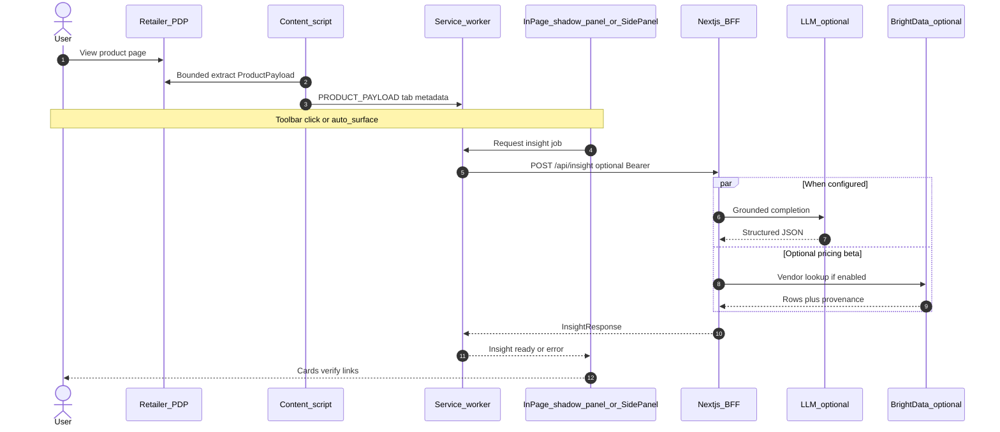

# ShopFriend (Smart Shopper)

This monorepo implements the **Smart Shopper** project brief: a browser companion that surfaces useful context on product pages. The chosen brief is documented in [requirements/brief.requirement.md](requirements/brief.requirement.md).

**Delivered functionality, stack, decisions, and learnings** are summarized in **[overview.md](overview.md)**.

## Structure


| Path                   | Description                                                                                                                                                                                    |
| ---------------------- | ---------------------------------------------------------------------------------------------------------------------------------------------------------------------------------------------- |
| `apps/web`             | Next.js 15 — marketing/auth routes, **BFF** Route Handlers (`/api/insight`, `/api/insight/chat`). Optional Supabase when env vars are set (see [overview.md](overview.md) — Future: Supabase). |
| `apps/extension`       | Chrome MV3 extension — build output in `dist/`                                                                                                                                                 |
| `packages/shared`      | Zod schemas and types shared by web + extension                                                                                                                                                |
| `requirements/`        | Product and technical requirement docs                                                                                                                                                         |
| `supabase/migrations/` | **Reference / future** Postgres + RLS SQL (not required for local insight demo)                                                                                                                |


## Architecture (current flow)




## Setup

```bash
pnpm install
cp apps/web/.env.example apps/web/.env.local
```

**Minimal local demo:** leave Supabase vars empty in `.env.local` — `/api/insight` allows unauthenticated use unless `SHOPFRIEND_REQUIRE_INSIGHT_AUTH=true` and Supabase is configured (see [apps/web/docs/extension-auth-flow.md](apps/web/docs/extension-auth-flow.md)).

**Optional** (see comments in [apps/web/.env.example](apps/web/.env.example)):

- Supabase — `NEXT_PUBLIC_SUPABASE_URL`, `NEXT_PUBLIC_SUPABASE_ANON_KEY`, optional `SUPABASE_SERVICE_ROLE_KEY`
- OpenAI — `OPENAI_API_KEY`, `OPENAI_BASE_URL`
- Bright Data — `BRIGHT_DATA_API_TOKEN`
- Affiliate product search — `AFFILIATE_NETWORKS_`* ([apps/web/docs/affiliate-network.md](apps/web/docs/affiliate-network.md))

Development note: same-retailer (same-domain) affiliate offer filtering is temporarily disabled so price cards still appear while affiliate catalog alternatives are sparse on Affiliate.com.

Build the extension with `VITE_SHOPFRIEND_API_ORIGIN` (e.g. `http://localhost:3000`) in `apps/extension/.env` so the service worker can reach the BFF.

```bash
pnpm build
```

## Development

```bash
pnpm --filter web dev
pnpm --filter @shopfriend/extension dev
```

Load **Unpacked** from `apps/extension/dist` after a build. The dev manifest includes host permission for your configured API origin (default `http://localhost:3000/`*).

## Docs

- [overview.md](overview.md) — what was built, tools, decisions, learnings, Supabase inventory
- [requirements/tech-stack.requirement.md](requirements/tech-stack.requirement.md)
- [requirements/project.requirement.md](requirements/project.requirement.md)
- [apps/web/docs/extension-auth-flow.md](apps/web/docs/extension-auth-flow.md)
- [apps/web/docs/affiliate-network.md](apps/web/docs/affiliate-network.md)

