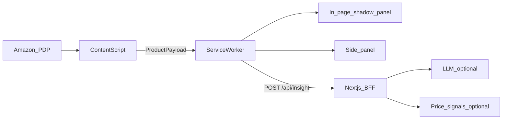

# ShopFriend / Smart Shopper — Business requirements (Shape A hackathon)

This document is the **business + product requirements** for the **3-day hackathon** MVP (**non–store-deployed** demo). It aligns with the shaping artifact **Smart Shopper — Shaping (3-day MVP, loophole focus)** (external Cursor plan; this file does not replace that plan).

---

## 1. Vision

Help shoppers on **product detail pages (PDP)** use a **Chrome-only** companion that offers **checkable** judgment support—not an authoritative oracle. The product optimizes for **interesting, falsifiable pointers** the user can **verify in one click** (source links, retailer deep links, return to the PDP).

---

## 2. Constraints and posture

### 2.1 Hackathon / non-release posture

- The **3-day build is not** a public Chrome Web Store release; **full legal/commercial diligence is out of scope** for this window.
- **Architecture and copy** must still allow **future compliance** without a rewrite: **explicit data paths** (on-device scrape vs payload to LLM vs vendor pipeline), **provider seams** (adapters, feature flags), and **no undeclared cross-site “agent” behavior**.

### 2.2 Product stance (decided): truth → checkable information

- **Do not** optimize for sounding infallible; optimize for **verify-first** UX.
- **Uncertainty is explicit** in UI (beta, experimental, match caveats, “LLM inference from on-page text only” where applicable).
- **Easy removal is mandatory** (see **R6**): users can silence noisy modules **without uninstalling** the extension.

---

## 3. Target user and context

- **Who:** Online shopper on a supported retailer PDP (**v1: Amazon.com**, US locale).
- **When:** While evaluating a **specific** product (not cart, not checkout, not generic search results).
- **Primary job:** Quickly sanity-check **review-derived judgment**, **returns/shipping pointers**, and optional **pricing pointers**, with **clear basis** and **one-click verification**.

---

## 4. Requirements (R) — full text (≤9 top-level)

Statuses are **product** statuses for the hackathon slice (not legal sign-off).

| ID  | Requirement                                                                                                                                                                                                                                                                                                                                    | Status                       |
| --- | ---------------------------------------------------------------------------------------------------------------------------------------------------------------------------------------------------------------------------------------------------------------------------------------------------------------------------------------------- | ---------------------------- |
| R0  | While viewing a **specific product listing**, the user gets **one clear judgment aid** (not a wall of raw tabs).                                                                                                                                                                                                                               | Core goal                    |
| R1  | The companion activates **only when it makes sense** (product context known); it does **not** pretend to help on irrelevant pages.                                                                                                                                                                                                             | Must-have                    |
| R2  | The user understands **what data each insight is based on** (on-page vs off-page vs vendor pipeline vs model inference); **no fake precision**; material claims are **checkable** — each includes a **verify path** (**link to primary source**, deep-link to on-page anchor, or explicit **“unverified / speculative”** when inference-only). | Must-have                    |
| R3  | **Low anxiety path:** user can quickly sanity-check **risky purchase factors** that matter pre-buy (returns/shipping/major complaints), **without legal advice** (scope negotiable). **Default mechanism: R3-A** — link-out + non-legal checklist; user verifies on retailer site.                                                             | Must-have (scope negotiable) |
| R4  | Insight latency is acceptable for browsing (**rough target < ~10s** or explicit async): **loading**, **cancel**, **hard timeout** (e.g. 12–15s), **retry**, short **cache** keyed by tab + URL.                                                                                                                                                | Must-have                    |
| R5  | **Privacy posture** is understandable (what leaves the device, if anything): **first-run + settings** “Data handling (demo)” copy; **disable LLM** path.                                                                                                                                                                                       | Must-have                    |
| R6  | **Honest limitations** when data is missing or ambiguous (no fabricated competitors/prices); **explicit uncertainty** in UI for experimental/beta modules; **easy removal** — user can **dismiss** major cards for the session and **hide** experimental modules persistently via settings **without uninstalling** the extension.             | Must-have                    |
| R7  | MVP is **demoable to a stranger** in under 60 seconds **and** the companion stays **discoverable** during shopping by supporting **both a Chrome Side Panel experience and a compact toolbar-driven surface** (in-page shadow panel and/or action flow; so the user is not dependent on remembering to open only one surface).                                                                           | Core goal                    |
| R8  | Works for **one chosen retailer + locale** first (**Amazon.com** PDP for v1).                                                                                                                                                                                                                                                                  | Must-have                    |

---

## 5. Shape A — product bundle (what ships)

### 5.1 Surfaces and discovery (A1, A1.1, R7)

- **Dual surfaces:** **Side Panel** (deep reading) + **in-page shadow panel** (compact entry from toolbar or auto-surface); same **insight session** state where feasible.
- **Toolbar default:** no manifest `default_popup`; `chrome.action.onClicked` messages the content script to mount the **shadow panel**, with **Side Panel** as fallback when messaging is unavailable. User can open **Side Panel** from the compact UI for explicit dual-surface discovery.
- **Auto-surface (optional, hackathon):** stored **domain allowlist + URL keyword/pattern**; **default ON** with **prominent disable**; validate `**chrome.action.openPopup()`** (Chrome **127+** notes in shaping) vs `**chrome.sidePanel.open()`** user-gesture constraints. Treat aggressive auto-open as a **UX risk** to validate in dogfood.

### 5.2 Page intelligence (A2, R1)

- **PDP vs non-PDP:** URL + DOM heuristics for **Amazon PDP**; **unsupported** short copy on cart, checkout, home, search results, and unknown pages.

### 5.3 Extraction contract (A3)

- Bounded `**ProductPayload`** (conceptual): title, ASIN if parseable, displayed price string, rating summary, bounded review snippets / “Customer says”-style text, seller/fulfillment fields where available.

### 5.4 Insight core (A4, A8, R0, R4)

- **Reality check** card: Pros / Cons / Best-for with **mandatory citations** to on-page excerpts (LLM **or** templated fallback if LLM off).
- **Async job UX:** cancel, timeout, retry, cache (see **R4**).

### 5.5 Bounded LLM blocks (A5, R2, R6)

Single round-trip or **one batched** model response, strictly:

1. **Satisfaction / risk themes** — pattern summary from **cited on-page review excerpts** only.
2. **Reputation glance** — short bullets grounded only in `**ProductPayload` facts** (e.g. sold-by / fulfilled-by, ratings/volume) + citations.

**Forbidden in v1:** scam/safe verdict, mystery **trust score**, claims of having “checked Trustpilot/Reddit/the web” **without retrieved artifacts** attached to the request.

### 5.6 Returns and shipping (A6, R3)

- **R3-A (selected):** checklist + **Open return policy on site** CTA via retailer-specific **help/returns deep link resolver** (no legal parsing).
- **R3-B (stretch):** DOM snippet extract + fallback to R3-A only if time allows and selectors are stable.

### 5.7 Disclosure and controls (A7, R5)

- **First-run + settings:** same disclosure strings in Popup and Side Panel (single-sourced copy).
- Toggles: **LLM enabled**, **auto-surface enabled**, **hide pricing beta**, session dismiss flags as specified in shaping **NonUI5** concept.

### 5.8 Experimental pricing (A9, R2, R6 — optional)

- **Optional** “pricing signals” card backed by a **Bright Data–class** (or similar) **vendor pipeline**, only as **beta**:
  - **Source URL + timestamp + match-quality caveat** on every row
  - **Per-row verify / source link**
  - **Dismiss** and **settings: hide pricing beta**
  - **Limitations** accordion content (see §7)
- **Kill criterion:** if match quality is poor in dogfood, **ship without A9**; core demo still wins on **reality check + citations + returns link-out**.

---

## 6. UX requirements aligned to breadboard (no implementation)

The following are **required UX behaviors** (IDs reference the shaping breadboard for traceability):

| ID   | UX requirement                                                                                              |
| ---- | ----------------------------------------------------------------------------------------------------------- |
| UI1  | **Unsupported** state on non-PDP with clear next step (“Open a product page”).                              |
| UI2  | **First-run disclosure** with **Continue** and **Disable LLM**; **identical copy** in Popup and Side Panel. |
| UI3  | **Settings → Data handling** entry from both surfaces.                                                      |
| UI4  | **Extracting / Generating** states with **Cancel** wired to job cancellation conceptually.                  |
| UI5  | **Reality check** card with citations (and verify anchors where applicable).                                |
| UI6  | **Returns & shipping** card: checklist + **Open return policy on site**.                                    |
| UI7  | Optional **A5** repeated-review themes list; each line must be **citable** or labeled speculative.          |
| UI8  | **Error + Retry** and **dismiss** where applicable.                                                         |
| UI9  | **Dismiss card** (session) + **Hide module** (persisted) for major blocks including **A9 beta**.            |
| UI10 | **Verify / source link** on any row that uses vendor data, model inference, or off-page pointers.           |
| UI11 | **Limitations** accordion: static copy plus dynamic “last fetched” when vendor pricing exists.              |

---

## 7. Trust, limitations, and copy (must ship)

### 7.1 Limitations accordion (minimum content)

- **What we did not see:** checkout-level fees/taxes, coupons, lightning deals, carts, other retailers unless shown via **A9** with source.
- **Why LLM output can be wrong:** summarization can miss nuance; user should trust only what they can **click back to** (citations / sources).
- **Why vendor price signals can be wrong:** SKU/offer mismatch, stale timestamps, seller variance — prefer **dismiss/hide** if noisy.

### 7.2 Labels and footer

- **Beta / experimental** on **A9** and any vendor-derived block.
- **Footer:** basis of summary (“from text visible on this page” + link to **view reviews on site**).

---

## 8. “Trusted data” — claim types (product rules)

| Claim               | Allowed basis for v1                                                                                                             |
| ------------------- | -------------------------------------------------------------------------------------------------------------------------------- |
| Review themes       | Quoted snippets from visible reviews / LLM clusters **with citations** to those snippets                                         |
| Price (on-page)     | Rendered PDP price as **context**, not “deal truth”                                                                              |
| Price (vendor beta) | Only if **A9** is on: **experimental** row with **source + time + caveat** + dismiss/hide                                        |
| Returns             | Merchant text on PDP **or** **R3-A** link-out                                                                                    |
| Reputation          | LLM **reformat/clusters** of **on-page** seller + review signals only (**A5**); no off-site browsing claims in hackathon default |

---

## 9. Anti-patterns (explicit non-requirements)

- **Dual-LLM** “researcher + judge” for Trustpilot/Reddit sweeps.
- **Web-browsing agents** that claim off-site research **without retrieved, attachable artifacts**.
- **Authoritative** “best price on the internet” or global **trust score** without a boring, fully disclosed formula (prefer omit **P4**).

---

## 10. Data flow (conceptual)

- **On-device:** classification + bounded extraction → `**ProductPayload`**; UI in shadow panel or side panel talks to the service worker only.
- **Off-device:** the **Next.js BFF** calls optional **LLM** and **vendor pricing** adapters; **keys never ship in the extension** (production posture).
- **A9 (optional):** vendor adapter returns **provenance** for every surfaced row.

---

## 11. Success criteria (demo script, ~60 seconds)

1. Open an **Amazon.com** PDP → use **toolbar action** (in-page shadow panel or side-panel fallback) → open **Side Panel** from explicit control when needed.
2. First run → **Data handling** → **Continue** or **Disable LLM**.
3. Non-PDP → **Unsupported**; PDP → **Extracting → Insight** with **citations** and verify paths per **R2**.
4. **Returns** card → checklist + link-out opens retailer context in a new tab.
5. If **A9** enabled: beta card shows **sources + limitations**; user can **dismiss** or **hide** in settings.
6. Confirm **easy removal**: a hidden module stays hidden across reload/session rules defined in shaping storage concept.

---

## 12. Open decisions (post-hackathon)

- Retailer expansion beyond **Amazon.com** US.
- Vendor choice for **A9** (Bright Data vs alternatives) and **legal review** before any public launch.
- Production **auth**, **rate limits**, **observability**, and **store listing**.

---

## 13. References

- [requirements/brief.requirement.md](brief.requirement.md) — original brief.
- Shaping plan: **Smart Shopper — Shaping (3-day MVP, loophole focus)** (Cursor plan file; authoritative for fit checks and breadboard tables).

