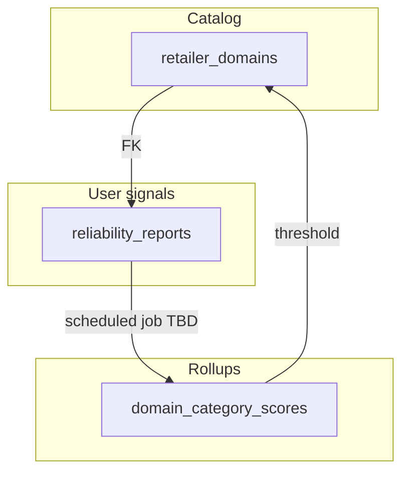

# Database schema (Supabase / Postgres) — ShopFriend

Reference for **tables, relationships, RLS, and migrations**. Complements [folder-structure.requirement.md](folder-structure.requirement.md). SQL lives in [../supabase/migrations/](../supabase/migrations/).

---

## Principles

- **Identities** live in `**auth.users`** (Supabase Auth). **Email** stays there; app tables reference `id` only.
- **App data** is in `**public`** with **Row Level Security (RLS)** using `**auth.uid()`** where users own rows.
- **Service role** bypasses RLS — use only from **Next.js server** (migrations, admin jobs, token minting). Never ship service role in the Chrome extension.

---

## Migration index


| File                                                                                        | Purpose                                                          |
| ------------------------------------------------------------------------------------------- | ---------------------------------------------------------------- |
| [00001_profiles.sql](../supabase/migrations/00001_profiles.sql)                             | `profiles` + RLS                                                 |
| [00002_retailer_domains.sql](../supabase/migrations/00002_retailer_domains.sql)             | Global retailer allowlist (`hostname`, `url_regex`) + RLS + seed |
| [00003_extension_link_codes.sql](../supabase/migrations/00003_extension_link_codes.sql)     | Short-lived web→extension link codes (hashed); RLS locked        |
| [00004_extension_devices.sql](../supabase/migrations/00004_extension_devices.sql)           | Extension device / session rows (`token_hash`); owner RLS        |
| [00005_user_preferences.sql](../supabase/migrations/00005_user_preferences.sql)             | Per-user `settings` jsonb + RLS                                  |
| [00006_insight_requests.sql](../supabase/migrations/00006_insight_requests.sql)             | Insight audit / history rows + RLS                               |
| [00007_reliability_reports.sql](../supabase/migrations/00007_reliability_reports.sql)       | User reliability reports (products + services) + RLS             |
| [00008_domain_category_scores.sql](../supabase/migrations/00008_domain_category_scores.sql) | Rolled-up scores per domain×category + `auto_insights_disabled`  |


---

## Entity relationship (target)

```mermaid
erDiagram
  AUTH_USERS ||--o| PROFILES : id
  AUTH_USERS ||--o{ EXTENSION_LINK_CODES : user_id
  AUTH_USERS ||--o{ EXTENSION_DEVICES : user_id
  AUTH_USERS ||--o| USER_PREFERENCES : user_id
  AUTH_USERS ||--o{ INSIGHT_REQUESTS : user_id
  AUTH_USERS ||--o{ RELIABILITY_REPORTS : user_id

  RETAILER_DOMAINS ||--o{ RELIABILITY_REPORTS : retailer_domain_id
  RETAILER_DOMAINS ||--o{ DOMAIN_CATEGORY_SCORES : retailer_domain_id

  AUTH_USERS {
    uuid id PK
  }

  PROFILES {
    uuid id PK_FK
    text display_name
    timestamptz created_at
  }

  RETAILER_DOMAINS {
    uuid id PK
    text hostname UK
    text url_regex
    text label
    boolean is_active
    int sort_order
    text notes
    text disabled_reason
    timestamptz created_at
    timestamptz updated_at
  }

  EXTENSION_LINK_CODES {
    uuid id PK
    uuid user_id FK
    text code_hash UK
    timestamptz expires_at
    timestamptz consumed_at
    timestamptz created_at
  }

  EXTENSION_DEVICES {
    uuid id PK
    uuid user_id FK
    text token_hash UK
    text label
    text user_agent_hash
    timestamptz created_at
    timestamptz expires_at
    timestamptz last_seen_at
    timestamptz revoked_at
  }

  USER_PREFERENCES {
    uuid user_id PK_FK
    jsonb settings
    timestamptz updated_at
  }

  INSIGHT_REQUESTS {
    uuid id PK
    uuid user_id FK
    text product_fingerprint
    jsonb flags
    jsonb response
    timestamptz created_at
  }

  RELIABILITY_REPORTS {
    uuid id PK
    uuid user_id FK
    uuid retailer_domain_id FK
    text category_key
    text listing_kind
    text product_fingerprint
    text title_snapshot
    text severity
    text notes
    timestamptz created_at
  }

  DOMAIN_CATEGORY_SCORES {
    uuid id PK
    uuid retailer_domain_id FK
    text category_key
    int report_count
    int negative_report_count
    numeric computed_score
    boolean auto_insights_disabled
    timestamptz last_computed_at
  }
```


---

## Reliability flow (product)




- Users submit `**reliability_reports**` (negative signals) for a **retailer domain** and a `**category_key`** (normalized slug). Use sentinel `**_domain_wide`** when the report is about the domain overall, not a single category.
- `**listing_kind**` distinguishes **physical goods**, **digital goods**, **subscriptions / in-app services**, and **other services** so non-SKU listings are modeled.
- A **background job** (not in SQL migrations) should aggregate reports into `**domain_category_scores`**, update `**computed_score`**, and set `**auto_insights_disabled**` when the score drops **below a configured threshold** (app config). That **blocks insights / auto-surface for that domain×category** without necessarily turning off the whole domain.
- **Whole-domain** shutdown remains `**retailer_domains.is_active`** plus optional `**disabled_reason`** when a **stricter domain-wide** aggregate says the retailer is unsafe globally.

**Abuse / moderation:** rate limits, dedupe by `product_fingerprint`, and moderator tools are **application-layer**; RLS keeps users from reading others’ raw reports.

---

## Table reference

### `public.profiles`


| Column         | Type                       | Purpose                |
| -------------- | -------------------------- | ---------------------- |
| `id`           | uuid PK → `auth.users(id)` | One row per user.      |
| `display_name` | text                       | Optional display name. |
| `created_at`   | timestamptz                | Audit.                 |


**RLS:** owner select/insert/update (`auth.uid() = id`).

---

### `public.retailer_domains`

Global allowlist: **hostname** + **POSIX `url_regex`** tested against the **full URL** (v1 contract). Invalid regex can break queries — validate on write (server).


| Column                      | Type                 | Purpose                          |
| --------------------------- | -------------------- | -------------------------------- |
| `id`                        | uuid PK              |                                  |
| `hostname`                  | text unique not null | e.g. `www.amazon.com`            |
| `url_regex`                 | text not null        | Pattern full URL must match      |
| `label`                     | text                 | Admin label                      |
| `is_active`                 | boolean              | Master enable for this domain    |
| `sort_order`                | int                  | UI / evaluation order            |
| `notes`                     | text                 | Admin notes                      |
| `disabled_reason`           | text                 | Why off (manual or auto summary) |
| `created_at` / `updated_at` | timestamptz          |                                  |


**RLS:** `**authenticated`** may **select** all rows (read catalog). **No** insert/update/delete for `authenticated` / `anon` — catalog changes via **service role** (dashboard, migrations, admin API).

**Product toggle:** if the extension must read domains **before** login, add a read-only `**anon`** select policy (documented as optional hardening step).

---

### `public.extension_link_codes`

Short-lived **hashed** one-time codes for **web → extension** handoff. Raw code never stored.


| Column        | Type                   | Purpose           |
| ------------- | ---------------------- | ----------------- |
| `id`          | uuid PK                |                   |
| `user_id`     | uuid FK → `auth.users` |                   |
| `code_hash`   | text unique not null   | Hash of OTP       |
| `expires_at`  | timestamptz            | TTL               |
| `consumed_at` | timestamptz            | Single-use marker |
| `created_at`  | timestamptz            |                   |


**RLS:** enabled, **no policies** for `anon` / `authenticated` — only **service role** (Next.js) reads/writes.

---

### `public.extension_devices`

Long-lived **hashed** bearer material per install / device.


| Column                                                   | Type                 | Purpose               |
| -------------------------------------------------------- | -------------------- | --------------------- |
| `id`                                                     | uuid PK              |                       |
| `user_id`                                                | uuid FK              | Owner                 |
| `token_hash`                                             | text unique not null | Validated on `/api/`* |
| `label`                                                  | text                 | Optional device name  |
| `user_agent_hash`                                        | text                 | Optional fingerprint  |
| `created_at`, `expires_at`, `last_seen_at`, `revoked_at` | timestamptz          | Lifecycle             |


**RLS:** owner **select / update / delete** where `auth.uid() = user_id`. **Insert** intended via **service role** from Next.js (no insert policy for end users).

---

### `public.user_preferences`


| Column       | Type                        | Purpose                 |
| ------------ | --------------------------- | ----------------------- |
| `user_id`    | uuid PK → `auth.users`      |                         |
| `settings`   | jsonb not null default `{}` | Feature flags, UI prefs |
| `updated_at` | timestamptz                 |                         |


**RLS:** owner read/write (`auth.uid() = user_id`).

---

### `public.insight_requests`

Audit of `**POST /api/insight`** (or similar) for support, analytics, rate limits.


| Column                | Type        | Purpose                                   |
| --------------------- | ----------- | ----------------------------------------- |
| `id`                  | uuid PK     |                                           |
| `user_id`             | uuid FK     | Caller                                    |
| `product_fingerprint` | text        | Hash of retailer + ASIN or normalized URL |
| `flags`               | jsonb       | e.g. LLM on, pricing beta                 |
| `response`            | jsonb       | Stored insight JSON                       |
| `created_at`          | timestamptz |                                           |


**RLS:** owner **select** and **insert** where `auth.uid() = user_id` (server typically uses user JWT).

---

### `public.reliability_reports`

User-submitted **unreliable / suspicious** signals.


| Column                | Type                         | Purpose                                                                  |
| --------------------- | ---------------------------- | ------------------------------------------------------------------------ |
| `id`                  | uuid PK                      |                                                                          |
| `user_id`             | uuid FK                      | Reporter                                                                 |
| `retailer_domain_id`  | uuid FK → `retailer_domains` | **ON DELETE RESTRICT** — cannot delete domain while reports reference it |
| `category_key`        | text not null                | e.g. `electronics`; use `_domain_wide` for domain-only                   |
| `listing_kind`        | text                         | `physical_product`                                                       |
| `product_fingerprint` | text                         | Optional ASIN / URL hash / service id                                    |
| `title_snapshot`      | text                         | Optional listing title at report time                                    |
| `severity`            | text                         | e.g. `unreliable`, `suspicious`                                          |
| `notes`               | text                         | Free text                                                                |
| `created_at`          | timestamptz                  |                                                                          |


**RLS:** users **insert** and **select** **only their own** rows (`auth.uid() = user_id`). Moderation uses **service role**.

---

### `public.domain_category_scores`

Aggregated metrics per `**(retailer_domain_id, category_key)`**. Rows are **maintained by jobs** using service role, not edited by clients.


| Column                   | Type             | Purpose                                    |
| ------------------------ | ---------------- | ------------------------------------------ |
| `id`                     | uuid PK          |                                            |
| `retailer_domain_id`     | uuid FK          | **ON DELETE CASCADE**                      |
| `category_key`           | text not null    | Same convention as reports                 |
| `report_count`           | int              | Total reports counted in rollup            |
| `negative_report_count`  | int              | Weighted negative count (job-defined)      |
| `computed_score`         | numeric not null | v1 placeholder: e.g. 0–100, higher = safer |
| `auto_insights_disabled` | boolean          | Set true when score below threshold        |
| `last_computed_at`       | timestamptz      |                                            |


**Unique:** `(retailer_domain_id, category_key)`.

**RLS:** `**authenticated`** may **select** (extension + web read policy). **No** insert/update/delete for `authenticated` / `anon` — rollups via **service role** only.

**v1 score formula:** document as **implementation detail of the job** (e.g. `100 * (1 - weighted_negative_ratio)`); SQL migrations do not encode the formula beyond default `**computed_score = 100`**.

---

## Security notes

- **Tokens:** store **hashes only**; short TTL for link codes; revoke devices with `revoked_at`.
- `**url_regex`:** mitigate **ReDoS** — validate pattern complexity server-side before insert.
- `**reliability_reports`:** mitigate **brigading** — app-level caps, dedupe, future moderator role.

---

## References

- Migrations: [../supabase/migrations/](../supabase/migrations/)
- Extension auth (API): [../apps/web/docs/extension-auth-flow.md](../apps/web/docs/extension-auth-flow.md)

