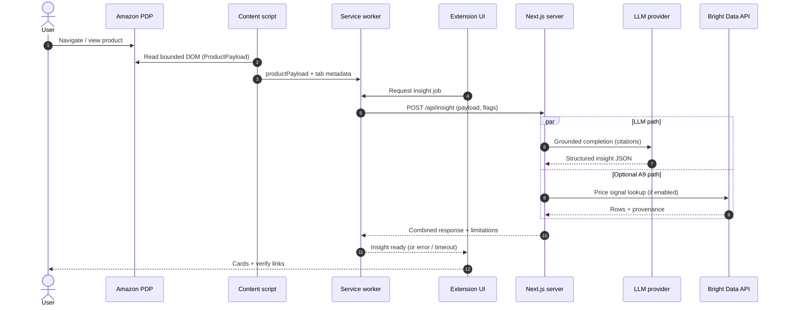
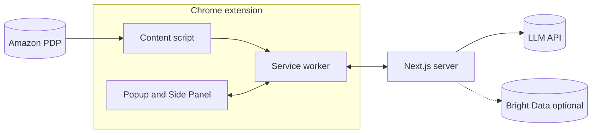

# ShopFriend / Smart Shopper — Project requirements (architecture & integrations)

This document describes **how the main parts talk to each other** for the Shape A stack: **Chrome extension (MV3)**, **Next.js server**, **LLM**, and **optional Bright Data–class pricing**. It complements [bussiness.requirement.md](bussiness.requirement.md) (product rules, R0–R8, UX breadboard).

---

## 1. Components (logical)

| Part                                  | Role                                                                                                                                                                                                         |
| ------------------------------------- | ------------------------------------------------------------------------------------------------------------------------------------------------------------------------------------------------------------ |
| **Retailer page (Amazon PDP)**        | Source DOM/text for bounded `**ProductPayload`** extraction.                                                                                                                                                 |
| **Content script**                    | Runs in page context: classification hints, bounded scrape/extract, **no secrets**.                                                                                                                          |
| **Service worker (background)**       | Orchestration, `fetch` to **Next.js**, caching/timeout/cancel, message hub to UI.                                                                                                                            |
| **Extension UI (Popup + Side Panel)** | Presents states, disclosures, insights, verify links; sends user actions to the service worker.                                                                                                              |
| **Next.js server**                    | **Single backend boundary**: auth/rate limits (as needed), calls **LLM** and **optional Bright Data adapter**, returns **structured JSON + provenance**; holds **API keys** (never in the extension bundle). |
| **LLM provider**                      | One (or batched) completion for grounded summaries with **citations** to on-page excerpts only (per business doc **A5**).                                                                                    |
| **Bright Data (or equivalent)**       | **Optional** vendor pipeline for **A9** beta pricing signals; server-side only; every row needs **source URL, timestamp, caveat** in the API response.                                                       |

---

## 2. Communication flow (Mermaid)

High-level **request path** for a single “generate insight” action (LLM on; A9 optional). Dashed lines indicate **optional** paths.

---

## 3. Simpler static view (optional)

---

## 4. Project requirements (non-functional)

- **Secrets:** LLM and Bright Data credentials exist **only** on the Next.js server (or managed secret store behind it), not in extension source or `chrome.storage`.
- **Payload minimization:** Send only the bounded `**ProductPayload`** (and identifiers like URL/ASIN), not full HTML dumps, unless a deliberate debug mode is gated and documented.
- **Timeouts and cancel:** Service worker and server enforce **hard timeouts** aligned with **R4**; client cancel should abort or ignore late responses safely.
- **Feature flags:** Server respects **LLM disabled** and **hide pricing beta** from the client payload so optional paths are not invoked.
- **Observability (post-hackathon):** Correlation id per job (tab + timestamp) for server logs; no PII in logs beyond what policy allows.

---

## 5. References

- [bussiness.requirement.md](bussiness.requirement.md) — product requirements, R-table, A9 kill criterion.
- [brief.requirement.md](brief.requirement.md) — original brief.

