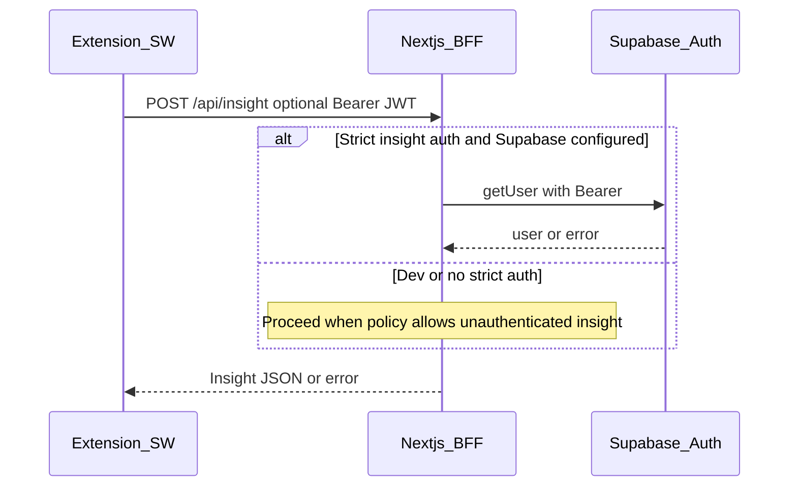
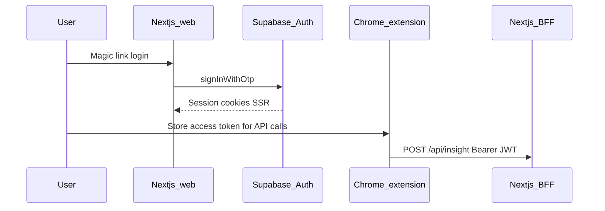

# ShopFriend / Smart Shopper — Technical stack

This document captures the **engineering stack** and **runtime architecture** agreed for the monorepo. Product rules remain in [bussiness.requirement.md](bussiness.requirement.md); integration flow in [project.requirement.md](project.requirement.md).

---

## 1. Monorepo layout

| Path | Purpose |
| --- | --- |
| [apps/web](../apps/web) | Next.js 15 (App Router): marketing + auth pages, **BFF** Route Handlers (`/api/*`). **Supabase** (session refresh, JWT validation) is **optional** until env vars and strict insight auth are enabled. |
| [apps/extension](../apps/extension) | Chrome MV3 extension (Vite + React + CRXJS): content script, service worker, **in-page shadow panel** + side panel (no manifest `default_popup`). |
| [packages/shared](../packages/shared) | Shared **Zod** schemas and types (`ProductPayload`, `/api/insight` contracts). |
| [supabase/migrations](../supabase/migrations) | **Reference / future** Postgres + RLS SQL (see [database-schema.requirement.md](database-schema.requirement.md)); not required for local insight demo. |

**Package manager:** `pnpm` workspaces. **Task runner:** Turborepo (`turbo.json`).

---

## 2. Versions (pinned at bootstrap)

| Area | Package | Notes |
| --- | --- | --- |
| Runtime | Node 20+ | Matches Next.js 15 / modern `fetch` / `crypto.randomUUID`. |
| Web | `next@15.5`, `react@19`, `react-dom@19` | App Router, Route Handlers as BFF. |
| Auth (optional) | `@supabase/supabase-js`, `@supabase/ssr` | When configured: web cookies via middleware; extension may send **Bearer JWT** on `/api/insight`. Local hackathon demo often runs **without** Supabase env (see §3). |
| Validation | `zod@3.24` | Shared package + Route Handlers + LLM output validation when LLM paths run. |
| Data fetching (UI) | `@tanstack/react-query@5` | Web + extension React surfaces. **Redux** not required for v1. |
| Extension build | `vite@6`, `@crxjs/vite-plugin@2`, `@vitejs/plugin-react@4` | MV3 bundle + HMR during development. |

---

## 3. Authentication (web + extension)

**Primary path today:** the extension service worker calls **`POST /api/insight`** on the Next.js BFF. **JWT validation via Supabase** runs only when `NEXT_PUBLIC_SUPABASE_URL` and `NEXT_PUBLIC_SUPABASE_ANON_KEY` are set **and** `SHOPFRIEND_REQUIRE_INSIGHT_AUTH=true` (then a valid Bearer token is required). Otherwise the hackathon/local demo often runs **without** Supabase env vars.



**Optional production login (web + extension token):** when Supabase is configured, users can sign in on the web app and attach the access token to extension calls.



**Authoritative write-up:** [apps/web/docs/extension-auth-flow.md](../apps/web/docs/extension-auth-flow.md).

**Rule:** Supabase **service role** never ships in the extension bundle. Tighten production with env + `SHOPFRIEND_REQUIRE_INSIGHT_AUTH` when ready.

---

## 4. External services

| Service | Where secrets live | Used for |
| --- | --- | --- |
| **LLM provider** | Next.js server env (`OPENAI_*`) | Grounded summaries + citations when keys are set. |
| **Bright Data (or equivalent)** | Next.js server env (`BRIGHT_DATA_API_TOKEN`) | Optional A9 beta pricing / discover paths with provenance. |
| **Affiliate product search** | Next.js server env (`AFFILIATE_NETWORKS_*`) | Optional merchant matches on `/api/insight` (see [affiliate-network.md](../apps/web/docs/affiliate-network.md)). |

---

## 5. Commands

```bash
pnpm install        # root — installs all workspaces
pnpm dev            # turbo dev (web + extension watch — see package scripts)
pnpm build          # turbo build
```

**Per app:**

- Web: `pnpm --filter web dev` → http://localhost:3000  
- Extension: `pnpm --filter @shopfriend/extension dev` → load unpacked `apps/extension/dist` in Chrome.

---

## 6. Chrome extension permissions (dev)

Manifest includes retailer hosts and the **configured API origin** (default `http://localhost:3000/*` from `VITE_SHOPFRIEND_API_ORIGIN`) for service worker `fetch`. Tighten or parameterize before store release.

---

## 7. References

- [project.requirement.md](project.requirement.md) — sequence diagram Next ↔ extension ↔ LLM ↔ Bright Data.
- [bussiness.requirement.md](bussiness.requirement.md) — R0–R8 and UX breadboard.
